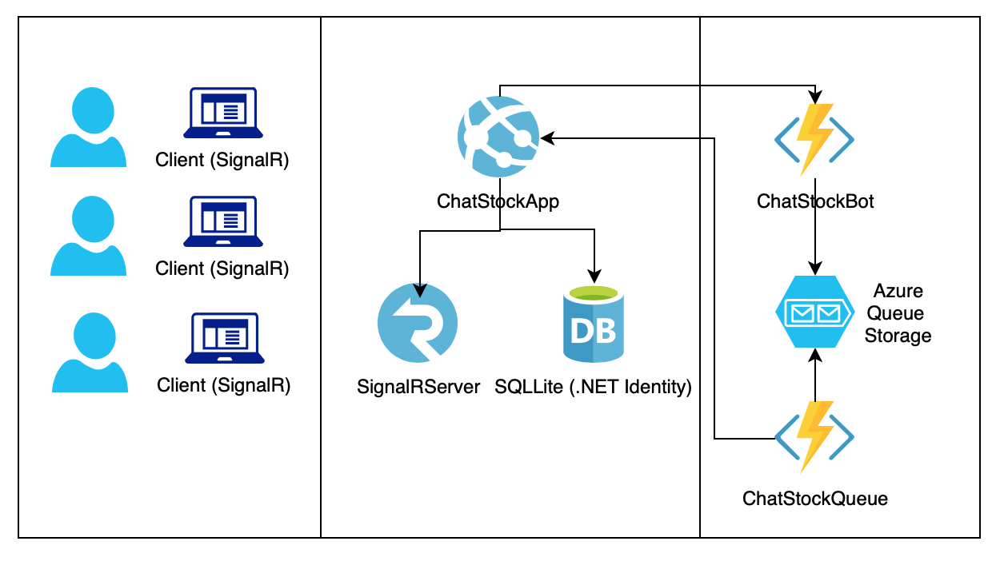

# ChatStockApp

# requirements

# Allow registered users to log in and talk
As a chat server and clientes I used SignalR with JavaScript

# Allow users to post messages as commands
To accomplish this requirement I created a decupled bot in Azure Functions. In order to work the appsetting file needs the Azure function URL
**Note:** the first time takes a while to respond since it is in a development plan

# The bot should parse the received CSV file and then it should send a message back into the chatroom using a message broker
I used Azure queue storage and an Azure Function to retrieve the message from the queue and post it into the chat room
In order to work the appsetting file needs the storage account string connection
**Note:** the first time takes a while to respond since it is in a development plan

# BONUS Use .NET identity for users
To accomplish this requirement I used .net identity with sqlite (for some reason SqlLite is not working in the appService in Azure, a local database only with the tables is been uploaded)

# Handle messages that are not understood
In case of an error a message "Please enter a valid symbol" will be send to the chatroom

# Plublished application 
The application has been published to an azure account in this [url](https://dfmerachatstockapp.azurewebsites.net/) 
